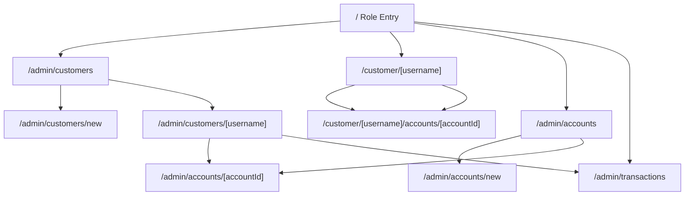
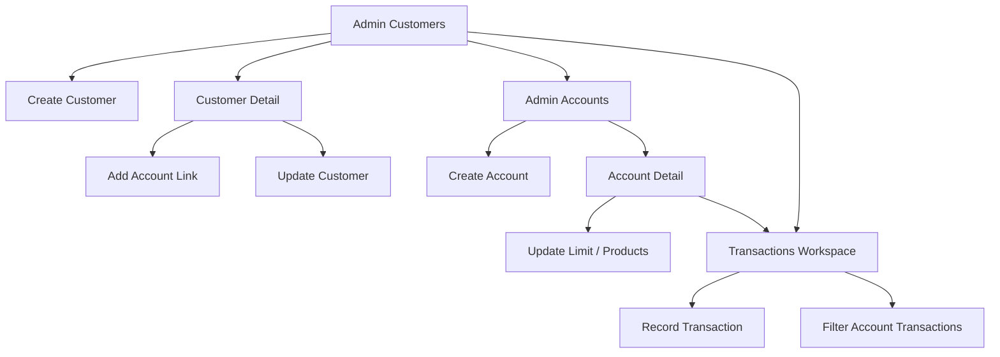
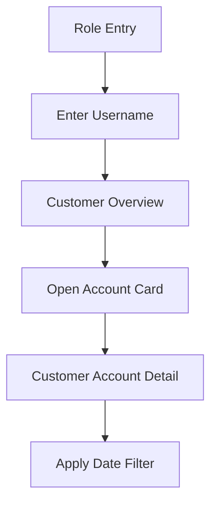

# Frontend Flow and Figma-Ready Wireframe Spec

This document is the handoff artifact for building the first-pass flow in Figma. It defines the sitemap, route relationships, screen structure, and content hierarchy for the separate `analytics-frontend` repo.

## Product Structure

- Audience:
  - admin users managing operational data
  - customers reviewing their own accounts and transactions
- Auth:
  - omitted in v1
  - role selection starts from the landing page
- Backend source:
  - this repo’s `analytics-gateway`

## Route Map

- `/`
- `/admin/customers`
- `/admin/customers/new`
- `/admin/customers/[username]`
- `/admin/accounts`
- `/admin/accounts/new`
- `/admin/accounts/[accountId]`
- `/admin/transactions`
- `/customer/[username]`
- `/customer/[username]/accounts/[accountId]`

## Global Layout Guidance

- Top bar:
  - product title
  - role switch links
  - current section label
- Page layout:
  - header row
  - action row
  - main content grid
- Shared UI states:
  - skeleton loading blocks
  - empty-state card with next action
  - inline form validation
  - full-page error panel for hard failures
  - inline warning banner for partial data issues

## Sitemap

## Screen Inventory

### 1. Role Entry `/`

Purpose:

- Provide a simple starting point for demo usage without authentication.

Primary blocks:

- hero header
- short explanation of admin vs customer paths
- admin entry card
- customer entry card with username input

Primary actions:

- go to admin customers
- go to customer overview by username

### 2. Admin Customers `/admin/customers`

Purpose:

- Browse customers and jump into record management.

Primary blocks:

- page title and create button
- customer list table
- cursor pagination controls
- quick open by username input

Columns:

- username
- name
- email
- accounts count
- actions

States:

- empty list
- invalid cursor recovery
- fetch failure retry

### 3. New Customer `/admin/customers/new`

Purpose:

- Create a customer profile.

Form fields:

- username
- full name
- email
- address
- birthdate

Actions:

- save customer
- cancel back to customer list

Validation:

- username required
- valid email required
- ISO-compatible date input

### 4. Customer Detail `/admin/customers/[username]`

Purpose:

- Manage a single customer and linked accounts.

Layout:

- left column: customer profile card and edit form
- right column: linked accounts panel and tier details panel

Profile section:

- username
- name
- email
- address
- birthdate

Linked account section:

- linked account list
- add account form
- remove action per row

Tier section:

- read-only tier cards
- active/inactive state
- benefits list

### 5. Admin Accounts `/admin/accounts`

Purpose:

- Review accounts with the existing limit-based filter.

Primary blocks:

- limit filter input
- accounts table
- create account button

Columns:

- account id
- limit
- products
- actions

### 6. New Account `/admin/accounts/new`

Purpose:

- Create an account record before linking it to a customer.

Form fields:

- account id
- trading limit
- products multi-entry input

Validation:

- positive account id
- non-negative limit
- at least one product

### 7. Account Detail `/admin/accounts/[accountId]`

Purpose:

- Adjust limit and products for one account.

Layout:

- summary card
- limit update panel
- product management panel

Summary content:

- account id
- current limit
- enabled products

Actions:

- update limit
- add product
- remove product

### 8. Transactions Workspace `/admin/transactions`

Purpose:

- Search and record transactions for a selected account.

Layout:

- search/filter panel at top
- summary cards row
- record transaction form
- results table

Search/filter fields:

- account id
- start date
- end date
- optional symbol

Summary cards:

- total buckets
- total transactions
- earliest date
- latest date

Record form fields:

- account id
- symbol
- amount
- price
- transaction code

### 9. Customer Overview `/customer/[username]`

Purpose:

- Give customers a single-screen summary.

Layout:

- profile summary card
- tier details card
- linked account cards grid
- recent activity section grouped by account

Account card content:

- account id
- limit
- products
- open account detail link

Recent activity block per account:

- latest five transactions
- empty state when none exist
- inline warning when recent activity is unavailable for that account

### 10. Customer Account Detail `/customer/[username]/accounts/[accountId]`

Purpose:

- Let the customer inspect a single account in more depth.

Layout:

- account summary
- bucket summary
- date filter bar
- transaction history table

Table columns:

- date
- symbol
- transaction code
- amount
- price
- total

## Primary Flows

### Admin CRUD Flow

### Customer Review Flow

## Wireframe Notes For Figma

- Use low-to-mid fidelity wireframes first:
  - grayscale surfaces
  - one accent color for actions
- Build reusable Figma components for:
  - page header
  - table row
  - stat card
  - empty state
  - inline alert
  - form row
- Keep admin screens denser and table-first.
- Keep customer screens calmer and card-first.
- Show at least one loading state, one empty state, and one inline warning example in the Figma file.
- Annotate the customer overview screen to note that recent transactions can fail per account without failing the whole page.
